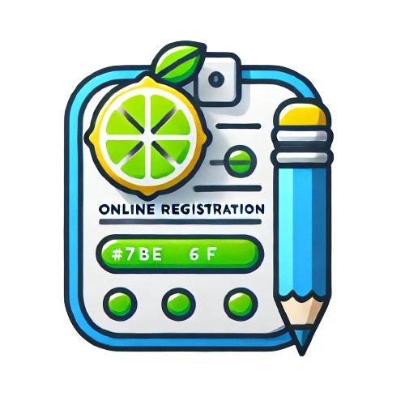

# CadastRAR 🚀

<div align="center">
  
  
  **AI-Powered Document Generation & Data Management Platform**
  
  *Streamlining business operations through intelligent automation*

  [](https://reactjs.org/)
  [](https://vitejs.dev/)
  [](https://firebase.google.com/)
  [](https://tailwindcss.com/)
  [](LICENSE)
</div>

---

## 🌟 Overview

CadastRAR is a cutting-edge SaaS platform that revolutionizes how businesses handle data management and document generation. Leveraging artificial intelligence, we transform manual, time-consuming processes into streamlined, automated workflows.

### 🎯 Mission
*To empower businesses with intelligent automation that eliminates paperwork bottlenecks and accelerates operational efficiency.*

## ✨ Key Features

### 🤖 **AI-Powered Document Generation**
- Intelligent template processing with personalized content
- Automated document creation from structured data
- Multi-format export capabilities (PDF, Word, Excel)

### 👥 **Advanced User Management**
- Secure authentication with Firebase Auth
- Role-based access control
- Real-time user state management

### 📊 **Smart Data Processing**
- Dynamic form generation and validation
- Cloud-based data storage with Firestore
- Real-time synchronization across devices

### 🎨 **Modern User Experience**
- Responsive design with Tailwind CSS
- Dark/Light mode support
- Intuitive dashboard and analytics

### 🔒 **Enterprise-Grade Security**
- Environment-based configuration management
- Secure API integrations
- Data encryption and privacy compliance

## 🛠️ Tech Stack

### Frontend
- **React 18** - Modern React with hooks and concurrent features
- **Vite** - Lightning-fast build tool and development server
- **Tailwind CSS** - Utility-first CSS framework with custom design system
- **React Router v6** - Declarative routing for React applications
- **React Icons** - Popular icon library with extensive collection

### Backend & Infrastructure
- **Firebase Auth** - Secure authentication and user management
- **Firestore** - NoSQL document database with real-time capabilities
- **Firebase Hosting** - Fast and secure web hosting
- **Environment Variables** - Secure configuration management

### Development & Quality
- **ESLint** - Code linting and quality enforcement
- **PostCSS** - CSS processing and optimization
- **Yarn** - Fast and reliable package management

## 🚀 Quick Start

### Prerequisites
- [Node.js](https://nodejs.org/) (v16 or higher)
- [Yarn](https://yarnpkg.com/) package manager
- Firebase project with Auth and Firestore enabled

### Installation

1. **Clone the repository**
   ```bash
   git clone git@github.com:limatainer/cadastRAR.git
   cd cadastRAR
   ```

2. **Navigate to frontend directory**
   ```bash
   cd frontend
   ```

3. **Install dependencies**
   ```bash
   yarn install
   ```

4. **Environment Setup**
   ```bash
   # Create .env file and add your Firebase configuration
   cp .env.example .env
   # Edit .env with your Firebase credentials
   ```

5. **Start development server**
   ```bash
   yarn dev
   ```

6. **Build for production**
   ```bash
   yarn build
   ```

## 🏗️ Project Structure

```
cadastRAR/
├── frontend/
│   ├── src/
│   │   ├── components/        # Reusable UI components
│   │   ├── contexts/          # React context providers
│   │   ├── hooks/             # Custom React hooks
│   │   ├── pages/             # Route components
│   │   ├── firebase/          # Firebase configuration
│   │   └── main.jsx           # Application entry point
│   ├── public/                # Static assets
│   ├── package.json           # Dependencies and scripts
│   └── vite.config.js         # Vite configuration
└── README.md
```

## 🤝 Contributing

We welcome contributions from the community! Please follow these steps:

1. Fork the repository
2. Create a feature branch (`git checkout -b feature/amazing-feature`)
3. Commit your changes (`git commit -m 'Add amazing feature'`)
4. Push to the branch (`git push origin feature/amazing-feature`)
5. Open a Pull Request

### Development Guidelines
- Follow the existing code style and conventions
- Write meaningful commit messages
- Add tests for new features
- Update documentation as needed

## 🎯 Roadmap

- [ ] **Q1 2024**: Advanced AI document templates
- [ ] **Q2 2024**: Multi-language support
- [ ] **Q3 2024**: Advanced analytics dashboard
- [ ] **Q4 2024**: Enterprise SSO integration
- [ ] **2025**: Mobile application development

## 📄 License

This project is licensed under the MIT License - see the [LICENSE](LICENSE) file for details.

## 👥 Team

**Mariana Lima** - *Full Stack Developer & Founder*
- GitHub: [@limatainer](https://github.com/limatainer)
- LinkedIn: [Mariana Lima](https://linkedin.com/in/mariana-lima)

## 🙏 Acknowledgments

- Built with [Vite](https://vitejs.dev/) for blazing fast development
- Styled with [Tailwind CSS](https://tailwindcss.com/) for modern design
- Powered by [Firebase](https://firebase.google.com/) for backend services
- Icons by [React Icons](https://react-icons.github.io/react-icons/)

---

<div align="center">
  <strong>⭐ Star this repo if you find it helpful!</strong>
  <br><br>
  Made with ❤️ by the CadastRAR team
</div>
